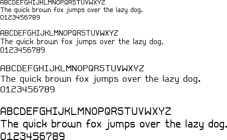

Retro16
=======

Development
-----------

* [FontForge](https://fontforge.github.io/)
* [ttfautohint](https://www.freetype.org/ttfautohint/):
  * Control file: `src/control.txt`
  * Default settings except all "Strong Stem Width and Positioning" options enabled.
* [Font Testing Page](https://github.com/impallari/font-testing-page)
